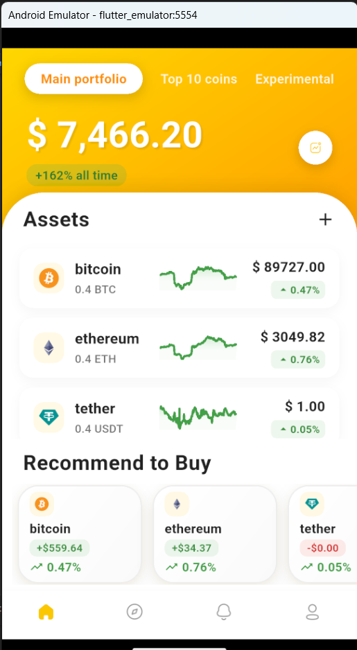
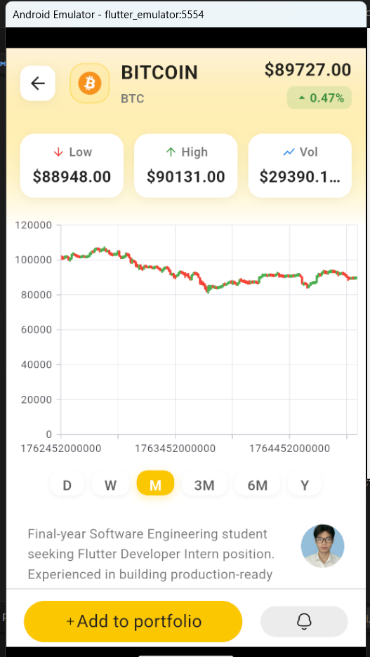

# � Crypto Portfolio App

A modern, feature-rich cryptocurrency portfolio tracking application built with Flutter. Track your crypto investments, view real-time price charts, and discover trending cryptocurrencies with a beautiful, intuitive interface.


## ✨ Features

### 🏠 Portfolio Management
- **Real-time Portfolio Value**: Track your total crypto portfolio value with live updates
- **Performance Metrics**: View your all-time gains/losses with percentage indicators
- **Asset Overview**: Monitor individual cryptocurrency holdings with current values and 24h changes
- **Multiple View Modes**: Switch between Main Portfolio, Top 10 Coins, and Experimental sections

### 📊 Cryptocurrency Tracking
- **Live Price Updates**: Real-time cryptocurrency prices from CoinGecko API
- **Price Charts**: Interactive candlestick charts with multiple timeframes (D, W, M, 3M, 6M, Y)
- **Sparkline Visualization**: Quick visual representation of price trends
- **24H Statistics**: View Low, High, and Volume data for each cryptocurrency

### 🎨 Modern UI/UX
- **Gradient Backgrounds**: Beautiful, vibrant color schemes
- **Card-based Design**: Clean, modern card layouts with subtle shadows
- **Smooth Animations**: Fluid transitions and hover effects
- **Responsive Design**: Optimized for various screen sizes
- **Dark Mode Support**: Eye-friendly dark theme

### 💡 Smart Recommendations
- **Recommended Coins**: AI-curated list of trending cryptocurrencies
- **Price Change Indicators**: Color-coded gains/losses for quick scanning
- **Detailed Coin Views**: In-depth information for each cryptocurrency

## 📸 Screenshots

### Home Screen

*Portfolio overview with assets list and recommendations*

### Coin Detail Screen

*Detailed cryptocurrency view with charts and statistics*

## �️ Tech Stack

- **Framework**: Flutter 3.24.5
- **Language**: Dart
- **State Management**: StatefulWidget
- **Charts**: 
  - syncfusion_flutter_charts (^27.2.5)
  - chart_sparkline (^1.0.13)
- **HTTP Client**: http (^1.2.2)
- **API**: CoinGecko API

## 📦 Dependencies

```yaml
dependencies:
  flutter:
    sdk: flutter
  cupertino_icons: ^1.0.8
  http: ^1.2.2
  syncfusion_flutter_charts: ^27.2.5
  chart_sparkline: ^1.0.13
```

## � Getting Started

### Prerequisites

- Flutter SDK (3.24.5 or higher)
- Dart SDK
- Android Studio / VS Code
- Android Emulator or Physical Device

### Installation

1. **Clone the repository**
   ```bash
   git clone https://github.com/huongdq24/crypto.git
   cd crypto
   ```

2. **Install dependencies**
   ```bash
   flutter pub get
   ```

3. **Run the app**
   
   For Chrome (Web):
   ```bash
   flutter run -d chrome
   ```
   
   For Android:
   ```bash
   flutter run -d android
   ```

## 📱 Supported Platforms

- ✅ Android
- ✅ Web
- ✅ Windows
- ✅ macOS
- ✅ iOS

## 🎯 Project Structure

```
lib/
├── Model/
│   └── coinModel.dart          # Cryptocurrency data model
├── View/
│   ├── Components/
│   │   ├── item.dart           # Asset list item component
│   │   └── item2.dart          # Recommendation card component
│   ├── home.dart               # Main portfolio screen
│   ├── selectCoin.dart         # Coin detail screen
│   └── anotherPage.dart        # Additional page
└── main.dart                   # App entry point

assets/
└── image/
    └── 11.png                  # User avatar image
```

## 🔧 Configuration

### API Setup

This app uses the CoinGecko API. No API key is required for basic functionality, but rate limits apply.

**Note**: The free tier API has request limitations. Please wait between requests to avoid errors.

### Postman Testing

A comprehensive Postman collection is available in `POSTMAN_GUIDE.md` for API testing.

## 🎨 Design Highlights

### Color Palette
- **Primary Gold**: `#FFD700` - Main accent color
- **Orange Gradient**: `#FFA500` → `#FF8C00` - Background gradients
- **Success Green**: `Colors.green.shade700` - Positive changes
- **Error Red**: `Colors.red.shade700` - Negative changes
- **Background**: White with subtle gradients

### Typography
- **Headers**: 22-24px, Bold
- **Body**: 15-18px, Semi-bold
- **Secondary**: 12-14px, Regular

### Components
- **Border Radius**: 12-24px for modern rounded corners
- **Shadows**: Elevation 2-8 for depth
- **Spacing**: Consistent 8px grid system

## 🐛 Known Issues & Solutions

- **Overflow Errors**: All layout overflow issues have been resolved
- **API Rate Limiting**: Free API has request limits; implemented proper error handling
- **Image Loading**: Added error builders for network images

## � Future Enhancements

- [ ] Add search functionality
- [ ] Implement favorites/watchlist
- [ ] Add price alerts
- [ ] Portfolio performance analytics
- [ ] Multi-currency support
- [ ] Biometric authentication
- [ ] Offline mode with caching
- [ ] News integration
- [ ] Trading functionality

## 👨‍💻 Developer

**Duong Quoc Huong**

Final-year Software Engineering student seeking Flutter Developer Intern position. Experienced in building production-ready cross-platform applications with BLoC state management, Firebase integration, and Clean Architecture.

## 📄 License

This project is licensed under the MIT License - see the LICENSE file for details.

## � Acknowledgments

- [CoinGecko API](https://www.coingecko.com/en/api) for cryptocurrency data
- [Syncfusion](https://www.syncfusion.com/flutter-widgets) for chart components
- Flutter community for excellent packages and support

## 📞 Contact

For questions or feedback, please reach out:

- GitHub: [@huongdq24](https://github.com/huongdq24)
- Repository: [crypto](https://github.com/huongdq24/crypto)

---

⭐ **Star this repo if you find it helpful!** ⭐
